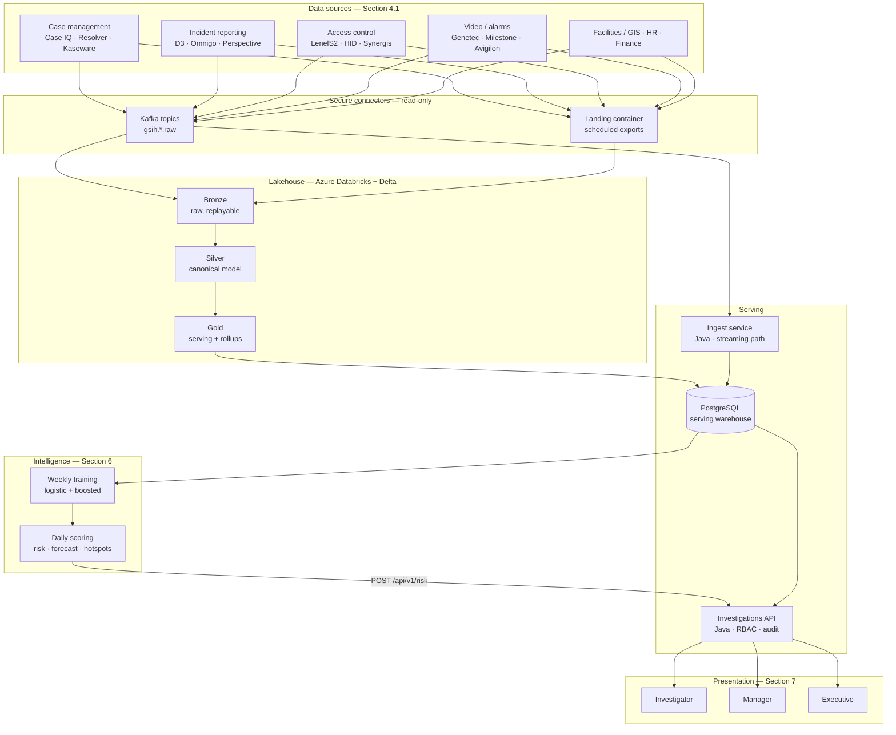

# Architecture

Implements the flow in Section 3.2 of the proposal. The hub connects to existing systems,
standardises what it reads, and presents it — it replaces nothing and writes back to
nothing.

## The two ingestion paths

Both land in the same canonical tables, and they exist for different reasons.

**Streaming (Java, `gsih-ingest-service`).** Consumes the raw topics, maps vendor
vocabularies onto the canonical model, and upserts into the serving warehouse. This is
what keeps a manager's dashboard current within seconds of an alarm firing. Offsets commit
only after the warehouse write returns; combined with upserts on the source record's
natural key, a redelivery converges on the same state rather than double-counting an
incident into someone's KPIs.

**Batch (PySpark, `pipelines/spark`).** Lands the same topics — plus the flat-file sources
that have no API — into bronze Delta, standardises them into silver, and publishes gold.
This is the replayable history the models train on and an audit reconstructs from.

The duplication is deliberate and has exactly one correctness risk: the two paths could
disagree about what a vendor status means. `pipelines/tests/test_mapping_parity.py` parses
both mapping tables and fails the build on any difference.

## Idempotency

Every write in the platform is keyed so that repeating it is harmless.

- Warehouse rows use a UUID derived deterministically from `sourceSystem + sourceId`, so
  replaying a Kafka partition updates rows rather than creating duplicates.
- Risk scores are keyed on `(site_code, score_date)`, so re-running an Airflow task
  overwrites the day's scores.
- Gold publication truncates and rewrites rather than appending, because a late-arriving
  correction from a source system changes history and an incrementally-maintained counter
  would keep the old number.

## Security posture (Section 5.3)

| Requirement | How |
|---|---|
| Read-only access to source systems | No write path exists. Connectors publish; nothing consumes back. |
| Role-based access control | Entra ID app roles → Spring authorities → `@PreAuthorize` on every endpoint. |
| Region confinement | The caller's `region` claim is threaded into the `where` clause of every query. A manager asking for another region gets their own. |
| Encryption in transit and at rest | TLS everywhere; Azure platform encryption on storage and the database. |
| Audit logs for all access | Append-only `audit_event` row per read, with actor, role, query and result count. Writes run in their own transaction so an audit failure cannot roll back — or be rolled back by — the user's query. |
| Data minimisation | Badge identifiers are salted-hashed at ingest; HR fields are limited to the authorised set; the raw badge number never enters the warehouse. |
| Secret handling | Workload identity federation — no pod holds a database password. The badge salt lives in Key Vault and is versioned with the warehouse, since rotating it re-keys every hash. |

## Failure behaviour

The interesting parts of a platform are what it does when something is wrong.

| Situation | Behaviour |
|---|---|
| Vendor sends an unrecognised status or category | Mapped to a documented default, never dropped; counted on `gsih.ingest.unmapped_category` so the discovery team can extend the table. |
| A payload cannot be parsed | Quarantined to `gsih.ingest.dlq` with its source topic, per record — one malformed message never poisons the rest of its batch. |
| An event arrives for an unknown site | Stored without a region and counted on `gsih.ingest.unknown_site`; a risk score for an unknown site is dropped rather than plotted at coordinates the platform does not have. |
| The predictive layer has not run | Dashboards render with an explicit "no scores yet" state rather than empty charts. |
| A retrained model is worse than the guardrail | Recorded in MLflow and discarded; the previous model stays in service. |
| Model explanation JSON is unreadable | The score is still served, without its factor breakdown. |
| The audit table is unreachable | The user's query still succeeds and the failure is logged. Blocking an investigator from their case queue because a logging table is down is the worse outcome. |
| A region has too little history to forecast | That region is skipped with a warning; the other curves are unaffected. |

## Refresh cadence

| Path | Cadence | Driven by |
|---|---|---|
| Streaming ingest | Continuous | Kafka consumer group |
| Bronze → silver → gold | Daily, 04:00 UTC | `gsih_daily` DAG — after overnight source exports, before the first shift |
| Risk scoring | Daily, after gold | `score_sites` task in the same DAG |
| Model retraining | Weekly, Sunday 02:00 UTC | `gsih_weekly_training` DAG |

Task order in the DAG is the point: features are not built until silver has finished, and
scores are not published until the features they came from are in the warehouse. Otherwise
a dashboard shows a risk score derived from yesterday's data beside today's case counts.
